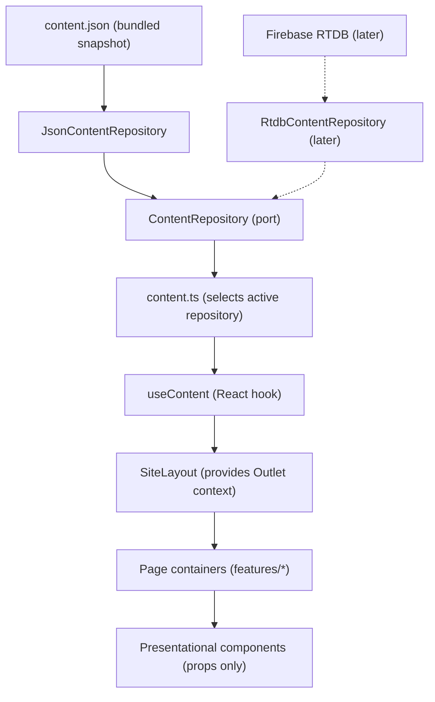

# Projeto Liberdade

Brochure website for **Projeto Liberdade**, a Brazilian equine-therapy and rehabilitation organization. The site is content-driven: today it renders from a bundled `content.json` snapshot; later the same seam will read from Firebase Realtime Database (RTDB) at runtime, with the JSON as a fallback.

The UI is a single-page React application with five public pages — **home**, **história**, **serviços**, **momentos**, and **contato** — plus a dev-only style guide at `/estilo`.

> **AI agents:** operating guidelines and the Superpowers workflow live in [AGENTS.md](./AGENTS.md). This README is the source of truth for the project overview, architecture, tooling, and commands.

## Table of Contents

- [Architecture](#architecture)
  - [Data flow](#data-flow)
  - [Project structure](#project-structure)
  - [The dependency rule](#the-dependency-rule)
- [Content and design](#content-and-design)
  - [Content model](#content-model)
  - [Design system](#design-system)
- [Development](#development)
  - [Tech stack](#tech-stack)
  - [Prerequisites](#prerequisites)
  - [Running the app](#running-the-app)
  - [Testing](#testing)
  - [Continuous integration](#continuous-integration)
- [Roadmap](#roadmap)
  - [Swapping to Firebase RTDB](#swapping-to-firebase-rtdb)
- [License](#license)

## Architecture

The app is organized around a single data-source boundary. Everything under `src/content` owns where content comes from; the rest of the UI is presentational and receives content via props.

### Data flow



Content flows one way: a repository resolves `SiteContent`, `useContent` exposes it, `SiteLayout` puts it on the router `Outlet` context, page containers read it with `useOutletContext`, and presentational components receive it purely through props.

### Project structure

```
src/
  content/      # THE boundary — data-source isolation
    types.ts                  # domain types
    ContentRepository.ts      # port (interface)
    JsonContentRepository.ts  # adapter — bundled content.json (now)
    content.ts                # binding: selects the active repository
    useContent.ts             # React hook used by the UI
    content.json              # snapshot data
    selectors.ts              # pure content selectors
  features/     # one folder per page (home, historia, servicos, momentos, contato)
  components/   # presentational, prop-driven UI
    ui/                       # Button, Card, Chip, ...
    blocks/                   # BlockRenderer + one renderer per block type
    sections/                 # reusable page sections (Hero, Historia, MVV, Services, ...)
    Header.tsx Nav.tsx Footer.tsx MobileDrawer.tsx SocialLinks.tsx ...
  styleguide/   # StyleGuide.tsx (dev-only, route /estilo)
  layouts/      # SiteLayout shell (provides Outlet context)
  lib/          # cn() and small utils
  routes.tsx    # router config
  main.tsx      # SPA entry
  index.css     # Tailwind entry / @import "tailwindcss"
tests/e2e/      # Playwright specs
docs/           # design references, content specs, and plans
scripts/        # tooling (e.g. content validation)
```

### The dependency rule

Non-negotiable — it keeps the data source swappable:

- Files under `features`, `components`, and `layouts` **never** import `content.json` or reference Firebase directly.
- `SiteLayout` (or a page container) retrieves data with `useContent` and flows it down through the router `Outlet` context. Page containers read it with `useOutletContext`; presentational components receive content via props only.
- Small, single-responsibility files; typed content; no prop-drilling of the data source.

## Content and design

### Content model

The content model is locked in [`docs/design/content-model.md`](./docs/design/content-model.md).

- English keys, Portuguese content values. Slugs double as URL paths (e.g. `/servicos/equoterapia`).
- Each page's `body` is an ordered array of typed blocks, discriminated by a `type` field. One renderer per block type lives in `src/components/blocks/`.
- Five pages: `home`, `historia`, `servicos`, `momentos`, `contato`.

### Design system

"Organic Freedom" — full reference in [`docs/design/organic-freedom/DESIGN.md`](./docs/design/organic-freedom/DESIGN.md).

- **Tokens** live in `src/index.css` as a Tailwind v4 `@theme` block — the single source of truth.
- **Hybrid palette:** the full MD3 color set is imported verbatim; the brand layer adds `--color-cta` (`#00aa5a`, vibrant CTA fill) plus `--color-cta-hover` / `--color-cta-strong` / `--color-link` (`#006d38` for hover, compact buttons, and small green text).
- **Buttons:** primary buttons use `#00aa5a` with a white label at `text-button` (≥18.66px / 700) so white-on-green meets WCAG AA for large text (3:1); compact buttons use `#006d38`.
- **Fonts:** Plus Jakarta Sans + Work Sans, self-hosted via `@fontsource` and imported in `src/main.tsx`.
- **Style guide:** every component is viewable at the dev route [`/estilo`](http://localhost:5173/estilo).

## Development

### Tech stack

| Concern                  | Choice                                                                                                                     |
| ------------------------ | -------------------------------------------------------------------------------------------------------------------------- |
| Language                 | TypeScript 6 (strict)                                                                                                      |
| UI                       | React 19                                                                                                                   |
| Build tool               | Vite 8                                                                                                                     |
| Routing                  | React Router v8 (data mode: `createBrowserRouter` + `RouterProvider`)                                                      |
| Styling                  | Tailwind CSS v4 via `@tailwindcss/vite` + `@import "tailwindcss"` in `src/index.css` (no `tailwind.config.js`, no PostCSS) |
| Unit / integration tests | Vitest + Testing Library                                                                                                   |
| E2E tests                | Playwright                                                                                                                 |
| Package manager          | pnpm                                                                                                                       |
| Formatting / linting     | ESLint (flat config) + Prettier — no semicolons, single quotes, trailing commas                                            |

### Prerequisites

- **Node.js** 20+ (Vite 8 / React 19 baseline)
- **pnpm** — run `corepack enable`; the version is pinned via the `packageManager` field in `package.json`, so Corepack selects the right one automatically

### Running the app

```bash
pnpm install   # Install dependencies
pnpm dev       # Start the dev server at http://localhost:5173
```

Other commands:

```bash
pnpm build     # Type-check (tsc -b) + production build
pnpm preview   # Preview the production build locally
pnpm lint      # Run ESLint
pnpm format    # Format with Prettier
```

### Testing

```bash
pnpm test        # Vitest unit + integration tests (run once)
pnpm test:watch  # Vitest in watch mode
pnpm test:e2e    # Playwright end-to-end tests
```

Vitest covers the content layer, selectors, pure utils, and component behavior (jsdom); Playwright specs live under `tests/e2e/` and cover page behavior in a real browser.

By default `pnpm test:e2e` runs Playwright against the dev server on port 5173. To reproduce CI locally, run `pnpm build` then `CI=1 pnpm test:e2e` — this serves the production build via `pnpm preview` on port 4173 and writes an HTML report to `playwright-report/`.

### Continuous integration

Every push to `master` (including PR merges) triggers the [`.github/workflows/tests.yml`](./.github/workflows/tests.yml) workflow, which runs two parallel jobs:

- **`unit`** — `pnpm lint`, `pnpm format:check`, then `pnpm test` (Vitest).
- **`e2e`** — `pnpm build`, then `pnpm test:e2e` (Playwright, chromium) against the production bundle served by `pnpm preview`.

The Playwright HTML report — with traces and failure screenshots — is uploaded as a `playwright-report` artifact on every non-cancelled run (pass or fail) and kept on the workflow run page for 30 days; it's the first place to look when an e2e run fails. Reproduce either job locally with the commands in [Testing](#testing).

## Roadmap

Build order for deferred work:

1. ~~Design tokens / Tailwind theme.~~ Done — see [Design system](#design-system).
2. ~~Shared components (Header, Footer, Nav, `blocks/` renderers).~~ Done — see `src/components/` and `/estilo`.
3. ~~Pages / content~~ — all five pages implemented (home, história, serviços, momentos, contato). Remaining page work: full content types + runtime validation, and bulk image migration.
4. **SEO prerender** — add `vite-react-ssg` for static HTML per route + per-page `<title>` / Open Graph tags.
5. **Firebase RTDB** — `RtdbContentRepository` + runtime fetch with fallback (see below).

### Swapping to Firebase RTDB

The content seam is already async, so switching data sources touches exactly one binding:

1. Add `src/content/RtdbContentRepository.ts` implementing `ContentRepository` (`getContent(): Promise<SiteContent>`), fetching from RTDB and falling back to the bundled snapshot.
2. Change the single binding in `src/content/content.ts` to use it.

Nothing in the UI changes.

## License

[MIT](./LICENSE.MD) © Eduardo Lima
